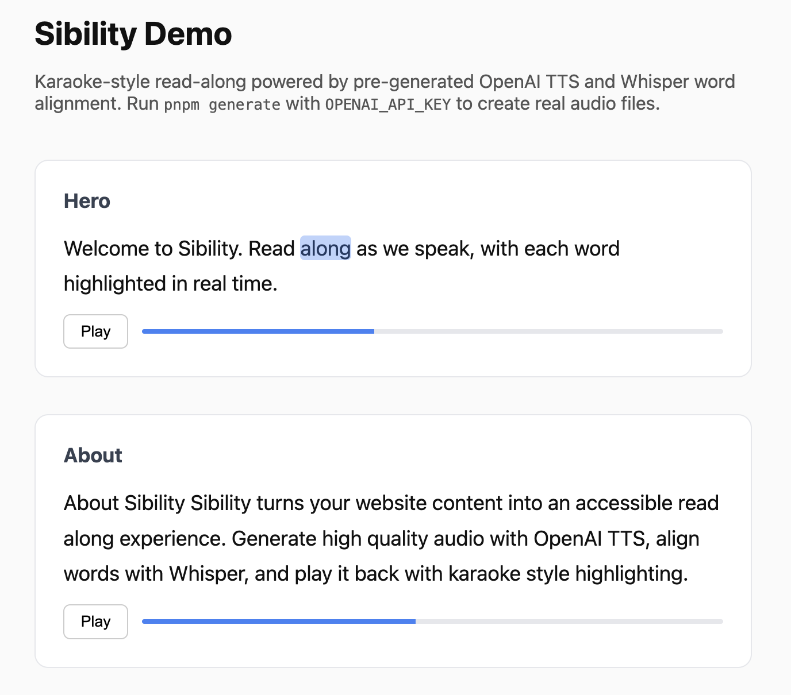

# Sibility

Installable React component and CLI for karaoke-style read-along with OpenAI TTS.



## Packages

| Package | Description |
|---------|-------------|
| [`sibility`](./packages/cli) | CLI — `npx sibility generate` pre-generates audio + word-alignment manifests |
| [`@sibility/react`](./packages/react) | React component with real-time word highlighting |
| [`@sibility/core`](./packages/core) | Shared types and manifest schema |

## Quick start

```bash
# Install
npm install @sibility/react
npm install -D sibility

# Scaffold config
npx sibility init

# Edit sibility.config.ts, then generate audio
OPENAI_API_KEY=sk-... npx sibility generate
```

```tsx
import { SibilityReader } from '@sibility/react';
import heroManifest from '../public/sibility/hero.json';

export function Hero() {
  return (
    <SibilityReader manifest={heroManifest}>
      <p>Welcome to our site. Read along as we speak.</p>
    </SibilityReader>
  );
}
```

## Development

```bash
pnpm install
pnpm build
```

See [`examples/nextjs`](./examples/nextjs) for a full demo.

## How it works

1. **Build time** — CLI calls OpenAI TTS, aligns words via Whisper, outputs MP3 + JSON manifests
2. **Runtime** — `<SibilityReader>` plays audio and moves a highlight overlay in sync with word timestamps

No server required at runtime. API keys are only used during `sibility generate`.
